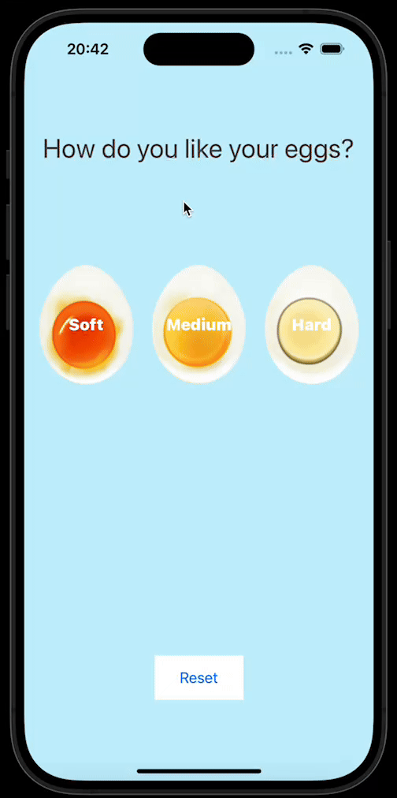

# Egg Timer

# Get to eat your boiled eggs at your desired hardness with the Egg Timer App! 🥚😎

# Egg Timer is keeping track of the cooking time depending on which hardness you choose to cook your boiled eggs at.

# There's three types of hardness to chose from: soft, medium, hard.

